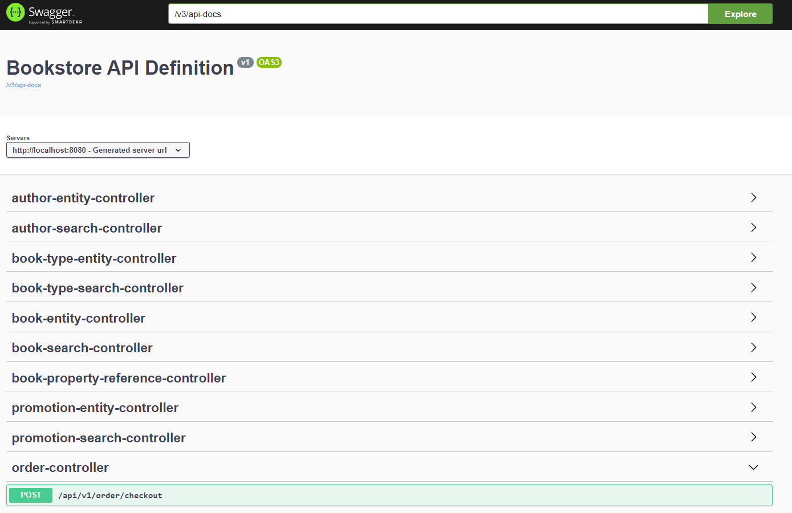

# Bookstore
### Java version: 11

**Libraries used**:
* Spring Web
* Spring Data JPA
* Spring Data REST
* Springdoc Open API
*  Springdoc Open API Data rest
  
**Database**: H2 (file based, in-memory for junits)


## Steps to Run
### Local 
Run these commands in terminal

```
mvn package
java -jar target/sd-bookstore-1.0.0.jar
```

### Docker
1) Build Image:
```
mvn package
docker build -t sd-bookstore:1.0.0 .
```
2) Run Container:
```
docker run -d -p 8080:8080 -t sd-bookstore:1.0.0
```

## Open API Spec
[open-api-spec.json](open-api-spec.json)

